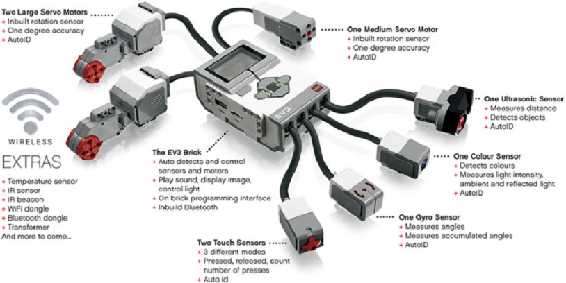
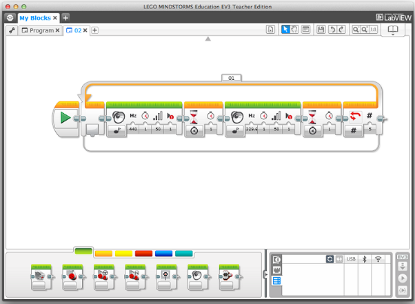
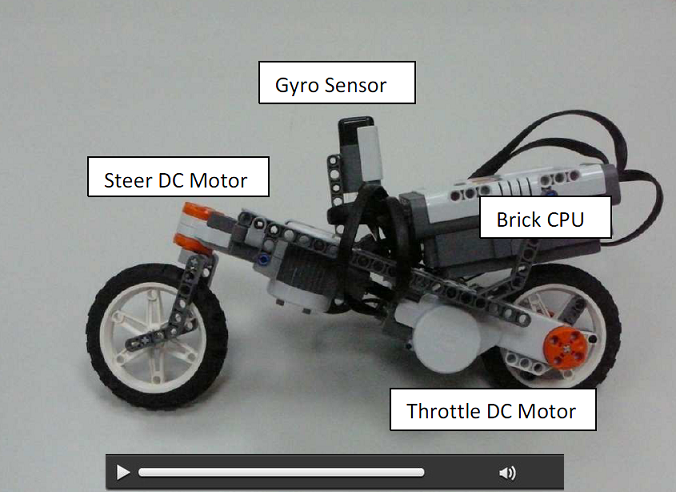

## Virtual Prototyping

Behzad Samadi, PhD  
[Mechatronics3D](http://www.mechatronics3D.com)  
DIPECC 2014, Dubai  
April 9, 2014

# It All Started with LEGO!

## LEGO MINDSTORMS NXT

  
[LEGO^®^](http://mindstorms.lego.com)

## LEGO MINDSTORMS EV3

  
[LEGO^®^](http://mindstorms.lego.com)

## Visual Programming

NXT-G  
  
[LEGO^®^](http://mindstorms.lego.com)

## Open Software

C#, BricxCC, Robolab, RoboMind, Enchanting, ROBOTC, NXTGCC, leJOS NXT, 
nxtOSEK, ICON, MATLAB and Simulink, Lua, Ada, URBI, FLL NXT Navigation, ruby-nxt, 
Robotics.NXT, LibNXT, PyNXC, NXT-Python, Physical Etoys  

## LEGO Bicycle

## Graph

digraph G {

	subgraph cluster_0 {
		style=filled;
		color=lightgrey;
		node [style=filled,color=white];
		a0 -> a1 -> a2 -> a3;
		label = "process #1";
	}

	subgraph cluster_1 {
		node [style=filled];
		b0 -> b1 -> b2 -> b3;
		label = "process #2";
		color=blue
	}
	start -> a0;
	start -> b0;
	a1 -> b3;
	b2 -> a3;
	a3 -> a0;
	a3 -> end;
	b3 -> end;

	start [shape=Mdiamond];
	end [shape=Msquare];
}