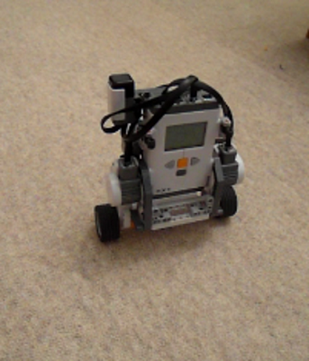
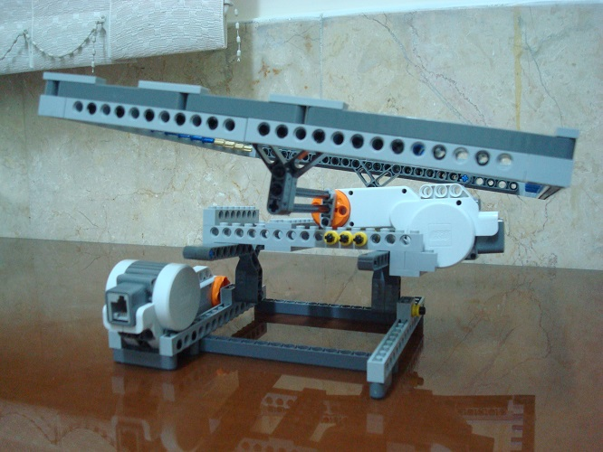
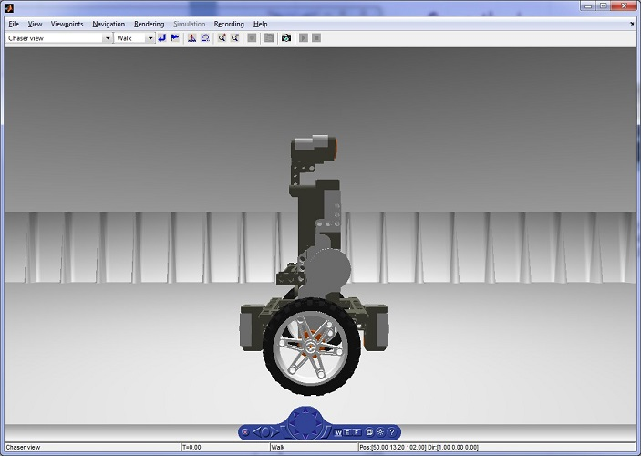
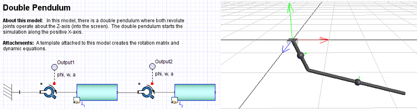

## Virtual Prototyping

Behzad Samadi, PhD  
[Mechatronics3D](http://www.mechatronics3D.com)  
DIPECC 2014, Dubai  
April 9, 2014

# It All Started with LEGO!

## LEGO MINDSTORMS NXT

  
[LEGO^®^](http://mindstorms.lego.com)

## LEGO MINDSTORMS EV3

  
[LEGO^®^](http://mindstorms.lego.com)

## Visual Programming

NXT-G  
  
[LEGO^®^](http://mindstorms.lego.com)

## Open Software

## Open Hardware

## Bicycle

  
Razyeh Mousavi

## Ballbot

## NXTway

  
[Hamid Bazargani](http://engcast.com/main/)  
[NXTway-GS](http://lejos-osek.sourceforge.net/videos.htm)

## Ball on Plate

## Active Front Steering

  
[Reza Azimi](http://brown.edu/research/labs/engineering-man-machine-systems/systems/people/students/razimi)  
[NXTway-GT](http://lejos-osek.sourceforge.net/videos.htm#NXT_GT_Hi)  

## LEGO MINDSTORMS

It was very exciting at first but I had more than 40 students and only 3 sets of LEGO Mindstorms!

## Amazing Journey

We realized that before making the robot, there were a lot of things that we needed to learn.

## Operating System

## Virtual Robot

## 3D Animation

## Controller Design

## How About a Virtual LEGO Set?

- This virtual robot is interesting but what if I want to build another robot?
- How hard is it to build a virtual robot?

## Causal Modeling 

- Writing the dynamic equations
- Converting the equations to ordinary differential equations
- Creating a signal flow model e.g. a Simulink model
- Building a virtual robot seems to be different from building a real robot

## Virtual LEGO Set

What if we had a set of virtual LEGO parts and we could build a robot with them?

## Virtual LEGO Set

We made one!  
  

- [ODE](http://www.ode.org/) (Open Dynamics Engine)
- [IrrLicht](http://irrlicht.sourceforge.net/) (Visualization)  

Alborz Gharraee

# Acausal Modeling

## Modelica and MapleSim 

- The connections between components are physical connections like position, voltage, flow,...
- Acausal modeling is very similar to building a real system

## Acausal Modeling with MapleSim

## Functional Mockup Interface

- Model Exchange, Co-Simulation, Product Lifecycle Management
- There are over 35 [Tools](https://www.fmi-standard.org/tools) supporting FMI

Courtesy of [ITAE](https://itea3.org/)

